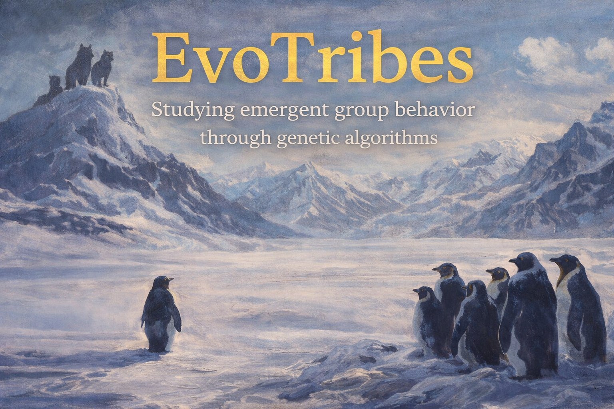

<div align="center">
  
</div>

<br/>

# EvoTribes

**A modular, learning-first genetic multi-agent simulation built with [Gymnasium](https://gymnasium.farama.org/) to study emergent group behaviour and alignment failures.**

[](VERSION)
[](https://github.com/Mbaka11/evo-tribes-genetic-tribes-sim/actions/workflows/ci.yml)
[](https://www.python.org/)

---

## What is EvoTribes?

EvoTribes drops multiple AI agents onto a shared 2D grid.
Agents belong to **tribes**, compete for **food**, spend **energy** to stay alive, and — in later iterations — **evolve** through a genetic algorithm.

The goal is **not** to build the fastest simulation.
It is to **understand** every component: how observations flow, how rewards shape behaviour, and how evolution pressures produce emergent strategies.

Every change is documented, every formula is explained, and every run is reproducible.

---

## Current Version

| Iteration | Version | Summary                                                  |
| --------- | ------- | -------------------------------------------------------- |
| 1         | 0.1.0   | Grid world, random agents, Pygame rendering, smoke tests |
| 2         | 0.2.0   | Policy interface, RandomPolicy, MLPPolicy (pure NumPy)   |

> Detailed notes for each iteration live in [`docs/notes/`](docs/notes/).

---

## Quick Start

### 1. Install dependencies

```bash
pip install gymnasium numpy pygame pytest
```

### 2. Run the demo

```bash
# Random policy (baseline)
python -m scripts.demo --policy random

# MLP policy with random weights (deterministic)
python -m scripts.demo --policy mlp

# MLP policy (stochastic sampling)
python -m scripts.demo --policy mlp --stochastic
```

### 3. Run tests

```bash
# All tests (environment + policies)
python -m pytest tests/ -v
```

---

## What You Should See

A Pygame window showing:

- A dark **20×20 grid**
- **Green dots** = food
- **Blue circles** = Tribe 0 agents, **Red circles** = Tribe 1 agents
- Tiny **energy bars** above each agent
- **Overlay** at the bottom: step count, alive agents, agent 0 energy
- Agents wander randomly, energy drains, agents die or the episode ends at step 300

---

## Project Structure

```
EvoTribes/
├── assets/images/        # project images
├── docs/
│   ├── notes/            # detailed iteration notes (start here!)
│   ├── learning/         # educational guides (genetic algorithms, neural nets, RL)
│   ├── 00_overview.md    # system goals & architecture
│   ├── 01_environment.md # env spec (obs, actions, rewards)
│   ├── 02_policies.md    # agent brains
│   ├── 03_genetic_algorithm.md
│   ├── 04_scenarios.md
│   ├── 05_metrics.md
│   └── 06_alignment_cases.md
├── scripts/
│   └── demo.py           # entry point with --policy flag
├── src/
│   ├── envs/
│   │   ├── tribes_env.py # Gymnasium environment
│   │   └── rendering.py  # Pygame renderer
│   └── policies/
│       ├── base_policy.py   # abstract interface
│       ├── random_policy.py # baseline
│       └── mlp_policy.py    # pure NumPy neural network
├── tests/
│   ├── test_env_smoke.py
│   └── test_policies.py
├── VERSION               # current version (0.2.0)
└── README.md
```

---

## Documentation

EvoTribes has **three types of documentation**:

### 📚 [Learning Resources](docs/learning/) — _Learn the concepts_

Educational guides explaining technical concepts from first principles:

- [Genetic Algorithms](docs/learning/genetic_algorithms.md) — complete tutorial with worked examples
- Neural Networks _(coming soon)_
- Reinforcement Learning Basics _(coming soon)_

**Start here if you're new to genetic algorithms or RL.**

### 📝 [Iteration Notes](docs/notes/) — _See what was built_

Detailed notes for each iteration explaining what changed and why:

- [Iteration 01](docs/notes/iteration_01.md) — Grid world environment
- [Iteration 02](docs/notes/iteration_02.md) — Policy interface
- More to come...

**Read these to understand the project's evolution.**

### 📖 [Main Docs](docs/) — _Reference the system_

Technical specifications and APIs:

- [00_overview.md](docs/00_overview.md) — system architecture
- [01_environment.md](docs/01_environment.md) — Gymnasium interface
- [02_policies.md](docs/02_policies.md) — policy implementations
- And more...

**Use these for API reference and architecture decisions.**

See [DOCUMENTATION_GUIDE.md](docs/DOCUMENTATION_GUIDE.md) for the full structure.

---

## Iteration Roadmap

| Iteration | Goal                                                    | Status  |
| --------- | ------------------------------------------------------- | ------- |
| 1         | Grid environment, random agents, rendering, tests       | ✅ Done |
| 2         | Policy interface, random policy, MLP policy             | ✅ Done |
| 3         | Genetic algorithm — evaluate, select, crossover, mutate | Planned |
| 4         | Metrics logging, run tracking, reproducibility          | Planned |
| 5         | Scenarios and parameter sweeps                          | Planned |
| 6         | Alignment case studies — reward hacking experiments     | Planned |

---

## Philosophy

- **Learn, don't speed-run.** Every component must be understood before moving on.
- **Traceability.** Every change is documented in iteration notes.
- **Reproducibility.** Seeds, configs, and logged metrics make every run repeatable.
- **Modularity.** Swap policies, change rewards, resize the grid — nothing else breaks.

---

## Contributing

This is a personal learning project. If you'd like to follow along or suggest improvements, open an issue or PR on GitHub.

---

## License

MIT
